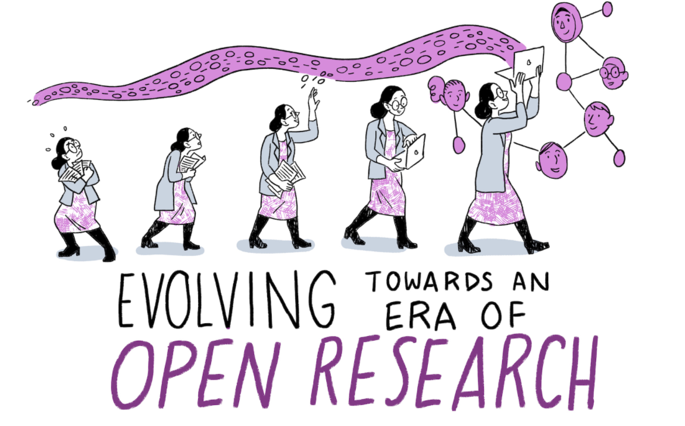

# Open_Science_Open_Future
An educational resource for young scientists, to embrace, practice, and share Open Science principles.

## What is OSOF?

Open science is vital for _reproducible, fair, and rigorous_ research. For its principles to thrive, we need OS practices to be adopted and shared by as many scientists as possible, from the earliest stages of their career. 
**"Open Science, Open Future" (OSOF)** is an educational resource available online for young scientists.

The project has a range of objectives:
- promote the application of the OS principles among STEM students and young scientists. They are the generation with the greatest potential (and time span!) to establish OS principles as a research reality;
- reaching out, through online resources, to students and researchers in small or isolated institutions who may have occasional to no opportunities to be trained on the OS principles;
- build an online community willing to sustain and spread the OSOF initiative by making use of the freely available material present on this platform.

A portfolio of subject-specific workshops is available on this platform. First time users are invited to contact OSOF to schedule an online interactive workshop session with the OSOF organizers. This way, we aim to train the next generation of OS ambassadors and empower them to freely use the available material and share it within their communities.
 

Illustration from the Turing Way book dashes

## Is OSOF for you?

- **Have you just started your career as a STEM student?** Are you having troubles with your assignments because you can't access research articles? With the OSOF workshops and offline material, you can learn why promoting open-access publications is vital for science to thrive, and become an open-science ambassador within your local scientific community. 
- **Are you a STEM graduate student?** Do you find yourself overwhelmed by the number of experimental protocols to use and share, the jungle of programming scripts you wrote and lost in your PC, the GB of data you must store and share with your collaborators? OSOF may help you by introducing you to the latest developed freely-available resources to manage your research life.
- **Are you a STEM PhD student** and would like to know more about the open science resources in your field? Jump in one of our online workshops or check out the offline material. Do you know it all already, and feel like contributing to OSOF yourself? Drop us a line at openscienceopenfuture@gmail.com! Tell us more about your subject, your skills, and your ideas. At OSOF, everyone can create their own subject-specific workshops and drive the change toward open science!
- **Are you a high school student or teacher?** Are you passionate about science? Are your students thinking about enrolling in a STEM degree? Find out more about the "OSOF goes to school workshops" here, drop us an email at openscienceopenfuture@gmail.com, and tell your school about OSOF!

## How does OSOF work?
#### OSOF for BSc, MSc, PhD students and postdoctoral scientists
 
1) If you are part of a small or big group and would like to be trained on the OS principles and attend an online workshop with us, send an email to openscienceopenfuture@gmail.com, and we will organize an event for you;
2) have a look at the online material before attending the workshop and think about any questions you may have for us;
3) after the workshop, feel free to share the available material and start your journey as an OS ambassador .
#### OSOF goes to school
1) If you are a high school teacher and would like to discover why open science principles can help your students become better future scientists, then email us at openscienceopenfuture@gmail.com;
2) work with us to organize an online event tailored to the background, needs, and aspirations of your students.

## Want to become part of the OSOF community?
Although we encourage you to freely use the material available on this platform, we would be grateful if you could drop us a line everytime you do so. Staying in touch will help us evaluate the contribution of OSOF to the OS mission, and make content changes accordingly. If you would like to:
1. attend an online interactive workshop,
2. create and share your own subject-specific workshop,
3. give us suggestions about how to improve OSOF...
...then email us at openscienceopenfuture@gmail.com!

It's time to get started!

